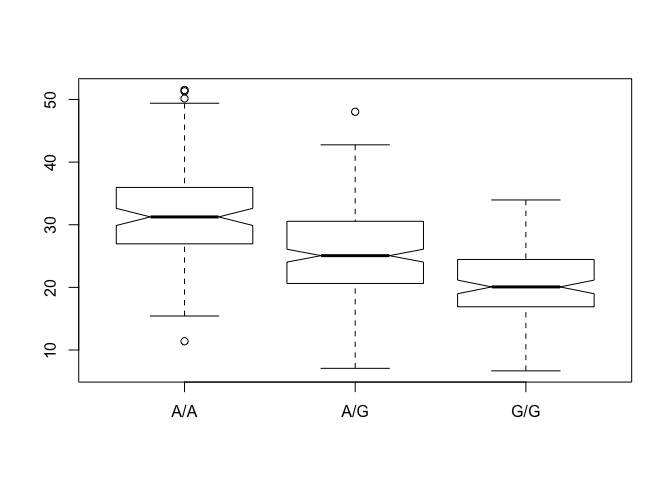
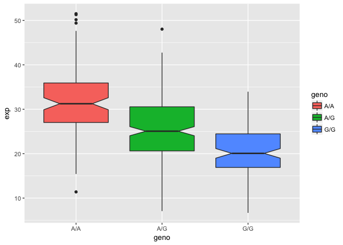
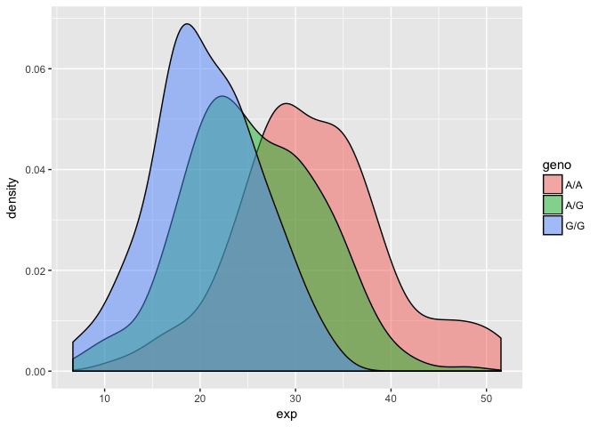
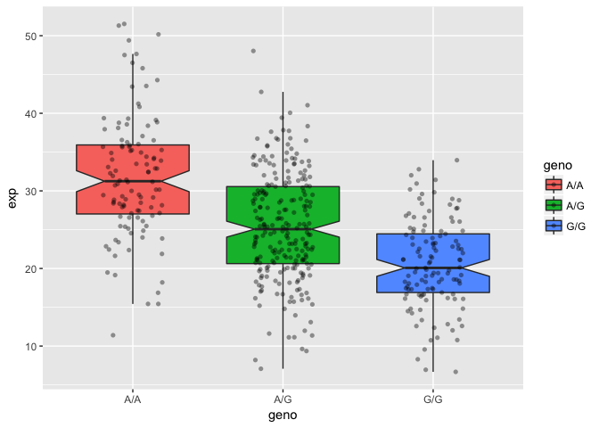

Read 1000 genome data for MXL dataset.

```r
genotype <-  read.csv("373531-SampleGenotypes-Homo_sapiens_Variation_Sample_rs8067378.csv")
```


```r
table(genotype[,2])/ nrow(genotype) * 100
```

```
## 
##     A|A     A|G     G|A     G|G 
## 34.3750 32.8125 18.7500 14.0625
```


```r
library(seqinr)
library(gtools)
phred <- asc( s2c("DDDDCDEDCDDDDBBDDDCC@")) -33
phred
```

```
##  D  D  D  D  C  D  E  D  C  D  D  D  D  B  B  D  D  D  C  C  @ 
## 35 35 35 35 34 35 36 35 34 35 35 35 35 33 33 35 35 35 34 34 31
```


RNA sequence 

```r
geno <- read.table("sample geno exp.txt")
```


```r
summary(geno)
```

```
##      sample     geno          exp        
##  HG00096:  1   A/A:108   Min.   : 6.675  
##  HG00097:  1   A/G:233   1st Qu.:20.004  
##  HG00099:  1   G/G:121   Median :25.116  
##  HG00100:  1             Mean   :25.640  
##  HG00101:  1             3rd Qu.:30.779  
##  HG00102:  1             Max.   :51.518  
##  (Other):456
```


```r
summary(geno$exp[geno$geno =="A/A"])
```

```
##    Min. 1st Qu.  Median    Mean 3rd Qu.    Max. 
##   11.40   27.02   31.25   31.82   35.92   51.52
```

```r
summary(geno$exp[geno$geno =="A/G"])
```

```
##    Min. 1st Qu.  Median    Mean 3rd Qu.    Max. 
##   7.075  20.626  25.065  25.397  30.552  48.034
```

```r
summary(geno$exp[geno$geno =="G/G"])
```

```
##    Min. 1st Qu.  Median    Mean 3rd Qu.    Max. 
##   6.675  16.903  20.074  20.594  24.457  33.956
```


## Let's make a boxplot

```r
boxplot(exp ~ geno, data = geno, notch = TRUE)
```

<!-- -->


```r
library(ggplot2)
ggplot(geno, aes(geno, exp, fill=geno)) + geom_boxplot(notch = TRUE)
```

<!-- -->


```r
## Histogram of the exp column with ggplot2
ggplot(geno, aes(exp, fill = geno)) + geom_density(alpha = 0.5)#alpha means tranprence
```

<!-- -->


```r
# Boxplot with the data shown
ggplot(geno, aes(geno, exp, fill=geno)) + 
  geom_boxplot(notch=TRUE, outlier.shape = NA) + 
  geom_jitter(shape=16, position=position_jitter(0.2), alpha=0.4)
```

<!-- -->

