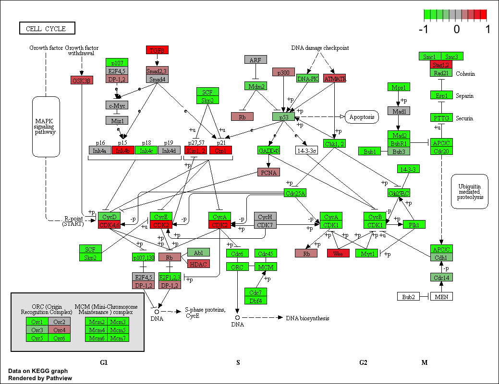
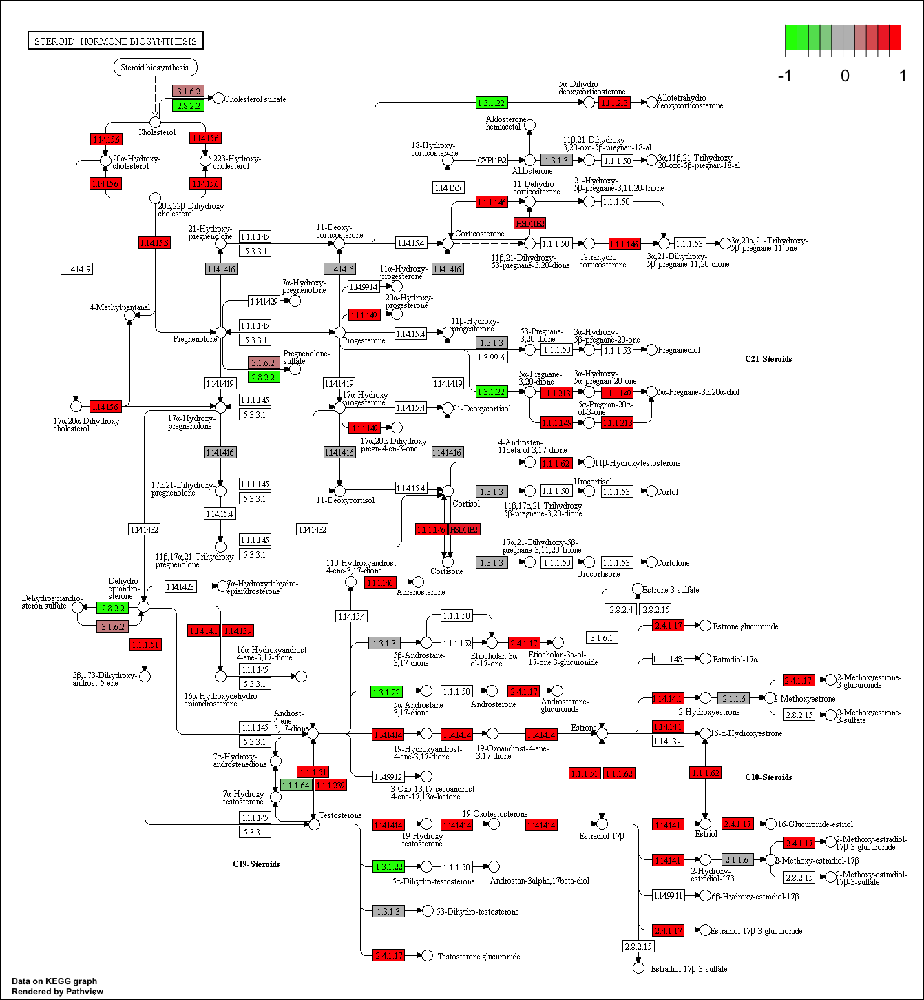
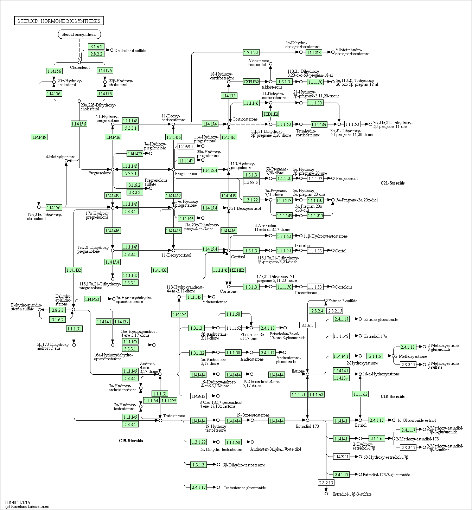

```{r setup, include=FALSE}
knitr::opts_chunk$set(echo = TRUE)
```

```{r, echo=FALSE}
library(DESeq2)
```

```{r}
metaFile <- "data/GSE37704_metadata.csv"
countFile <- "data/GSE37704_featurecounts.csv"
```

```{r}
# Import metadata and take a peak
colData = read.csv(metaFile, row.names=1)
head(colData)
```

```{r}
countData = read.csv(countFile, row.names=1)
head(countData)
```

```{r}
# Note we need to remove the odd first $length col
countData <- as.matrix(countData[,-1])
head(countData)
```

```{r}
# Filter count data where you have 0 read count across all samples.
countData <-  countData[rowSums(countData)>1, ]
head(countData)
```

```{r}
dds <-  DESeqDataSetFromMatrix(countData=countData,
                             colData=colData,
                             design=~condition)
dds <-  DESeq(dds)
```

```{r}
res <- results(dds)
res
```

```{r}
mcols(res, use.names = TRUE)
```

```{r}
summary(res)
```


lower the pValue or higher lfcthreshold

```{r}
#one way is using resutls
resSig <- results(dds, lfcThreshold = 2, alpha=0.05)
summary(resSig)
```

```{r}
# Make a new results object 'resSig' with only significant genes
resSig <- subset(res, padj < 0.05)

# Print the first 10 strongest DOWN genes
ord.down <- order(resSig$log2FoldChange)
head(resSig[ ord.down, ], 10)
```

```{r}
#another way is using table
table(resSig$padj < 0.05)
```

```{r}
table(resSig$log2FoldChange > 2)
```

```{r}
table( resSig$padj < 0.05, resSig$log2FoldChange > 2)
```

Since we mapped and counted against the Ensembl annotation, our results only have information about Ensembl gene IDs. However, our pathway analyssi downsteam will use KEGG pathway, and genes in KEGG pathways are annotated in anoter way.

## Annotation

```{r}
library("AnnotationDbi")
library("org.Hs.eg.db")
columns(org.Hs.eg.db)
```

```{r}
res$symbol = mapIds(org.Hs.eg.db,
                    keys=row.names(res), 
                    column="SYMBOL",
                    keytype="ENSEMBL",
                    multiVals="first")

res$entrez = mapIds(org.Hs.eg.db,
                    keys=row.names(res), 
                    column="ENTREZID",
                    keytype="ENSEMBL",
                    multiVals="first")

res$name =   mapIds(org.Hs.eg.db,
                    keys=row.names(res), 
                    column="GENENAME",
                    keytype="ENSEMBL",
                    multiVals="first")

head(res, 10)
```


Now Lets see how pathway analysis can help us make further sense out ot this reanked list of differently expressed genes.

##KEGG pathways

```{r}
source("http://bioconductor.org/biocLite.R")
biocLite( c("pathview", "gage", "gageData") )
```


```{r}
library(pathview)
library(gage)
library(gageData)

data(kegg.sets.hs)
data(sigmet.idx.hs)

kegg.sets.hs = kegg.sets.hs[sigmet.idx.hs]
head(kegg.sets.hs, 3)
```

```{r}
foldchanges = res$log2FoldChange
names(foldchanges) = res$entrez
head(foldchanges)
```

Now, let’s run the pathway analysis. 
```{r}
# Get the results
keggres = gage(foldchanges, gsets=kegg.sets.hs, same.dir=TRUE)
```

Lets look at the result object. It is a list with three elements (“greater”, “less” and “stats”).
```{r}
attributes(keggres)
```

```{r}
head(keggres$greater)
```


```{r}
# or you can use the function of lapply()
lapply(keggres, head)
```

Now, let’s process the results to pull out the top 5 upregulated pathways, then further process that just to get the IDs. We’ll use these KEGG pathway IDs downstream for plotting.


```{r}
## Sanity check displaying all pathways data
pathways = data.frame(id=rownames(keggres$greater), keggres$greater)
head(pathways)
```

Now, let’s try out the pathview() function from the pathview package to make a pathway plot with our result shown in color. 

```{r}
pathview(gene.data=foldchanges, pathway.id="hsa04110")
```


Here is the defalt low resolution raster PNG output from the first pathview() call above.


```{r}
# A different PDF based output of the same data
pathview(gene.data=foldchanges, pathway.id="hsa04110", kegg.native=FALSE)
```

```{r}
## Focus on top 5 upregulated pathways here for demo purposes only
keggrespathways <- rownames(keggres$greater)[1:5]

# Extract the IDs part of each string
keggresids = substr(keggrespathways, start=1, stop=8)
keggresids
```

```{r}
pathview(gene.data=foldchanges, pathway.id=keggresids, species="hsa")
```




## Gene Ontology.We can also do a similar procedure with gene ontology. 
```{r}
data(go.sets.hs)
data(go.subs.hs)
gobpsets = go.sets.hs[go.subs.hs$BP]

gobpres = gage(foldchanges, gsets=gobpsets, same.dir=TRUE)

lapply(gobpres, head)

```


## Section 4. Reactome Pathway Analysis
```{r}
sig_genes <- res[res$padj <= 0.05 & !is.na(res$padj), "symbol"]
print(paste("Total number of significant genes:", length(sig_genes)))
```

```{r}
write.table(sig_genes, file="significant_genes.txt", row.names=FALSE, col.names=FALSE, quote=FALSE)
```

## Bounus: Gene clustering, heatmaps and PCA


```{r}
vsd <- vst(dds, blind = FALSE)
```

```{r}
library("genefilter")

#row.variance <- apply(assay(vsd), 1, var)
row.variance <- rowVars(assay(vsd))
ord.variance <- order( row.variance, decreasing = TRUE) 

# Focus on top 20 most variable genes for demo purposes
mat  <- assay(vsd)[ ord.variance[1:20], ]
```

```{r}
library(pheatmap)
mat.center  <- mat - rowMeans(mat)
pheatmap(mat.center)
```


