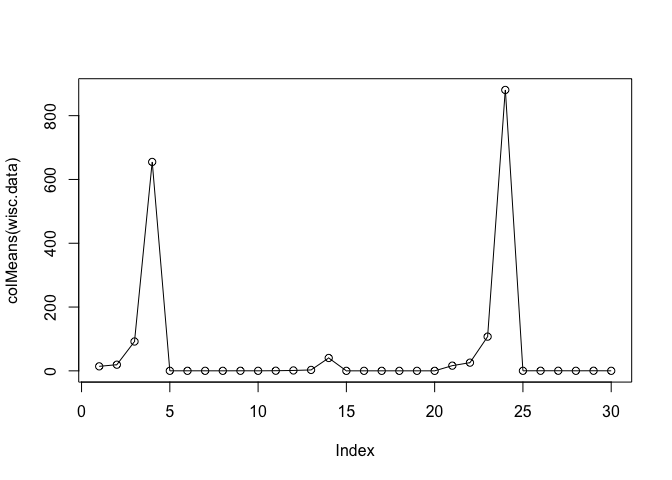
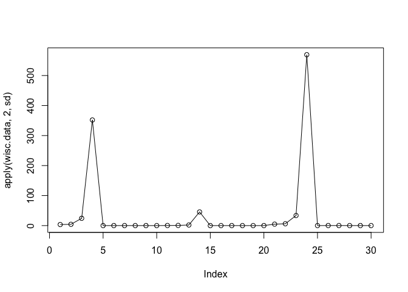
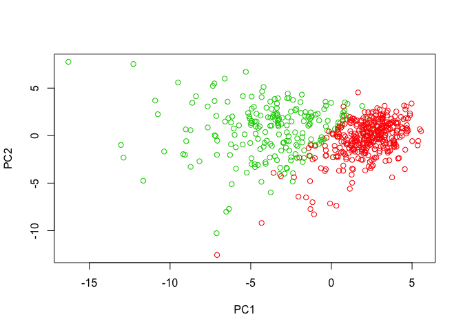
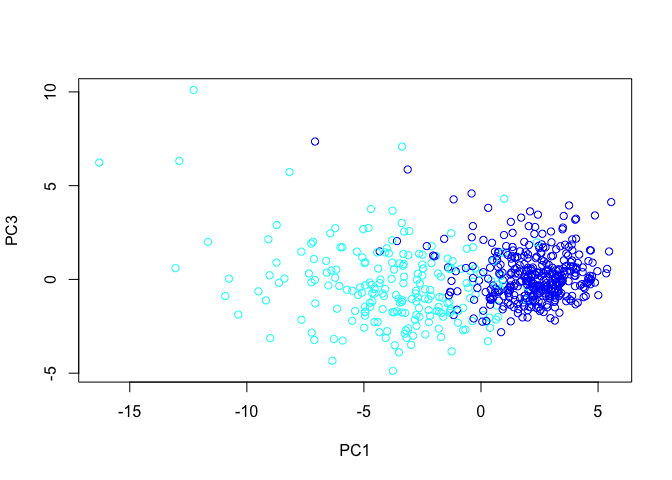
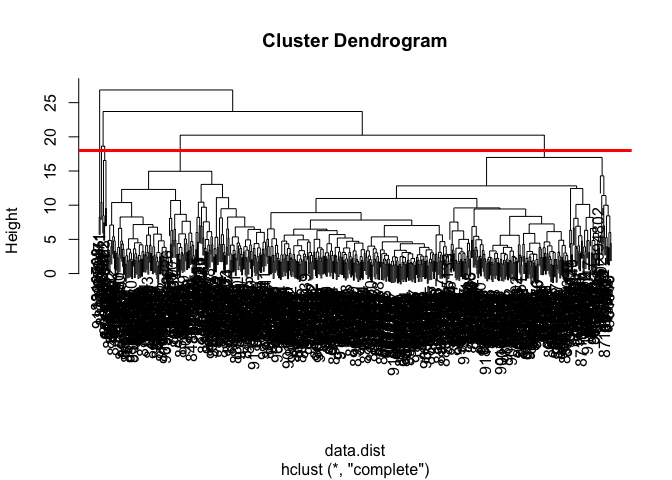
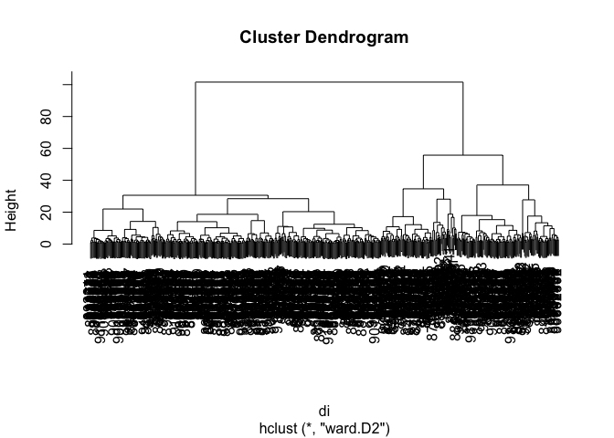
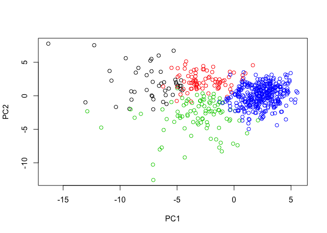
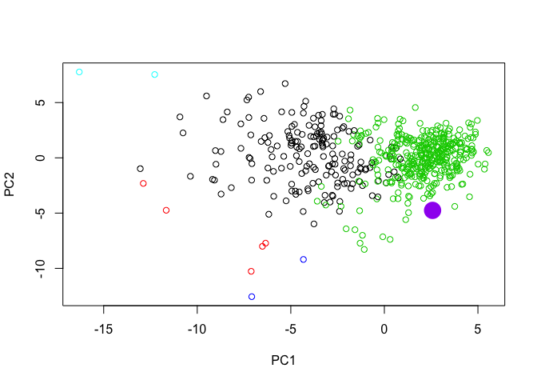

 
Let us read our data

```r
url <- "https://bioboot.github.io/bggn213_S18/class-material/WisconsinCancer.csv"
# Complete the following code to input the data and store as wisc.df
wisc.df <- read.csv(url)
head(wisc.df)
```

```
##         id diagnosis radius_mean texture_mean perimeter_mean area_mean
## 1   842302         M       17.99        10.38         122.80    1001.0
## 2   842517         M       20.57        17.77         132.90    1326.0
## 3 84300903         M       19.69        21.25         130.00    1203.0
## 4 84348301         M       11.42        20.38          77.58     386.1
## 5 84358402         M       20.29        14.34         135.10    1297.0
## 6   843786         M       12.45        15.70          82.57     477.1
##   smoothness_mean compactness_mean concavity_mean concave.points_mean
## 1         0.11840          0.27760         0.3001             0.14710
## 2         0.08474          0.07864         0.0869             0.07017
## 3         0.10960          0.15990         0.1974             0.12790
## 4         0.14250          0.28390         0.2414             0.10520
## 5         0.10030          0.13280         0.1980             0.10430
## 6         0.12780          0.17000         0.1578             0.08089
##   symmetry_mean fractal_dimension_mean radius_se texture_se perimeter_se
## 1        0.2419                0.07871    1.0950     0.9053        8.589
## 2        0.1812                0.05667    0.5435     0.7339        3.398
## 3        0.2069                0.05999    0.7456     0.7869        4.585
## 4        0.2597                0.09744    0.4956     1.1560        3.445
## 5        0.1809                0.05883    0.7572     0.7813        5.438
## 6        0.2087                0.07613    0.3345     0.8902        2.217
##   area_se smoothness_se compactness_se concavity_se concave.points_se
## 1  153.40      0.006399        0.04904      0.05373           0.01587
## 2   74.08      0.005225        0.01308      0.01860           0.01340
## 3   94.03      0.006150        0.04006      0.03832           0.02058
## 4   27.23      0.009110        0.07458      0.05661           0.01867
## 5   94.44      0.011490        0.02461      0.05688           0.01885
## 6   27.19      0.007510        0.03345      0.03672           0.01137
##   symmetry_se fractal_dimension_se radius_worst texture_worst
## 1     0.03003             0.006193        25.38         17.33
## 2     0.01389             0.003532        24.99         23.41
## 3     0.02250             0.004571        23.57         25.53
## 4     0.05963             0.009208        14.91         26.50
## 5     0.01756             0.005115        22.54         16.67
## 6     0.02165             0.005082        15.47         23.75
##   perimeter_worst area_worst smoothness_worst compactness_worst
## 1          184.60     2019.0           0.1622            0.6656
## 2          158.80     1956.0           0.1238            0.1866
## 3          152.50     1709.0           0.1444            0.4245
## 4           98.87      567.7           0.2098            0.8663
## 5          152.20     1575.0           0.1374            0.2050
## 6          103.40      741.6           0.1791            0.5249
##   concavity_worst concave.points_worst symmetry_worst
## 1          0.7119               0.2654         0.4601
## 2          0.2416               0.1860         0.2750
## 3          0.4504               0.2430         0.3613
## 4          0.6869               0.2575         0.6638
## 5          0.4000               0.1625         0.2364
## 6          0.5355               0.1741         0.3985
##   fractal_dimension_worst  X
## 1                 0.11890 NA
## 2                 0.08902 NA
## 3                 0.08758 NA
## 4                 0.17300 NA
## 5                 0.07678 NA
## 6                 0.12440 NA
```


```r
#how many dianosis are cancer vs non cancer
table(wisc.df$diagnosis)
```

```
## 
##   B   M 
## 357 212
```
Let's make a new data of matrix in the interest in it

```r
wisc.data <- as.matrix(wisc.df[, -c(1,2, 33)])
# Set the row names of wisc.data
rownames(wisc.data) <- wisc.df$id
#x <- c("mary", " barry", "peter")
#x[-1] # which means everything except the first one
#x[-c(1,4)] which means deduct first and forth
```


```r
# Create diagnosis vector by completing the missing code
diagnosis <- as.numeric( wisc.df$diagnosis == "M")
sum(diagnosis) # always double check whether you got the right number
```

```
## [1] 212
```


```r
# Q1. How many observations are in this dataset?
dim(wisc.data)
```

```
## [1] 569  30
```

```r
ncol(wisc.data)
```

```
## [1] 30
```

```r
# Q2. How many variables/features in the data are suffixed with _mean?
grep("_mean", colnames(wisc.data), value = TRUE, invert = TRUE) # value true give you the name in your data and invert true give you the data that doesn't match the pattern
```

```
##  [1] "radius_se"               "texture_se"             
##  [3] "perimeter_se"            "area_se"                
##  [5] "smoothness_se"           "compactness_se"         
##  [7] "concavity_se"            "concave.points_se"      
##  [9] "symmetry_se"             "fractal_dimension_se"   
## [11] "radius_worst"            "texture_worst"          
## [13] "perimeter_worst"         "area_worst"             
## [15] "smoothness_worst"        "compactness_worst"      
## [17] "concavity_worst"         "concave.points_worst"   
## [19] "symmetry_worst"          "fractal_dimension_worst"
```

```r
length(grep("_mean", colnames(wisc.data), value = TRUE, invert = TRUE) )
```

```
## [1] 20
```

```r
# Q3. How many of the observations have a malignant diagnosis?
table(wisc.df$diagnosis)
```

```
## 
##   B   M 
## 357 212
```


```r
# Check column means and standard deviations
# if it's hard to look at the table directly, plot it!
plot(colMeans(wisc.data), type='o')
```

<!-- -->

```r
plot(apply(wisc.data,2,sd), type = 'o')
```

<!-- -->


```r
# you have to ensure there's no NA in your data, otherwise sscal cannot be applied
wisc.pr <- prcomp(wisc.data, scale. = TRUE)

summary(wisc.pr)
```

```
## Importance of components:
##                           PC1    PC2     PC3     PC4     PC5     PC6
## Standard deviation     3.6444 2.3857 1.67867 1.40735 1.28403 1.09880
## Proportion of Variance 0.4427 0.1897 0.09393 0.06602 0.05496 0.04025
## Cumulative Proportion  0.4427 0.6324 0.72636 0.79239 0.84734 0.88759
##                            PC7     PC8    PC9    PC10   PC11    PC12
## Standard deviation     0.82172 0.69037 0.6457 0.59219 0.5421 0.51104
## Proportion of Variance 0.02251 0.01589 0.0139 0.01169 0.0098 0.00871
## Cumulative Proportion  0.91010 0.92598 0.9399 0.95157 0.9614 0.97007
##                           PC13    PC14    PC15    PC16    PC17    PC18
## Standard deviation     0.49128 0.39624 0.30681 0.28260 0.24372 0.22939
## Proportion of Variance 0.00805 0.00523 0.00314 0.00266 0.00198 0.00175
## Cumulative Proportion  0.97812 0.98335 0.98649 0.98915 0.99113 0.99288
##                           PC19    PC20   PC21    PC22    PC23   PC24
## Standard deviation     0.22244 0.17652 0.1731 0.16565 0.15602 0.1344
## Proportion of Variance 0.00165 0.00104 0.0010 0.00091 0.00081 0.0006
## Cumulative Proportion  0.99453 0.99557 0.9966 0.99749 0.99830 0.9989
##                           PC25    PC26    PC27    PC28    PC29    PC30
## Standard deviation     0.12442 0.09043 0.08307 0.03987 0.02736 0.01153
## Proportion of Variance 0.00052 0.00027 0.00023 0.00005 0.00002 0.00000
## Cumulative Proportion  0.99942 0.99969 0.99992 0.99997 1.00000 1.00000
```

Q4. From your results, what proportion of the original variance is captured by the first principal components (PC1)?
A: 0.4427

Q5. How many principal components (PCs) are required to describe at least 70% of the original variance in the data?
A: 3

Q6. How many principal components (PCs) are required to describe at least 90% of the original variance in the data?
A:7


```r
biplot(wisc.pr)
```

<!-- -->


```r
# Scatter plot observations by components 1 and 2
plot( wisc.pr$x[, c(1,2)], col=diagnosis + 2, xlab = "PC1", ylab = "PC2")
```

<!-- -->


```r
# Repeat for components 1 and 3
plot(wisc.pr$x[, c(1, 3)], col = (diagnosis + 4), 
     xlab = "PC1", ylab = "PC3")
```

<!-- -->


## Screen plots showing the proportion of variance explained as the number of principal components increases

```r
#Calculate the variance of each principal component by squaring the sdev component of wisc.pr (i.e. wisc.pr$sdev^2). Save the result as an object called pr.var.
pr.var <-  wisc.pr$sdev^2
pve <- pr.var / sum(pr.var)
plot(pve, xlab = "Principal Component", 
     ylab = "Proportion of Variance Explained", 
     ylim = c(0, 1), type = "o")
```

<!-- -->


```r
barplot(pve, ylab = "Precent of Variance Explained",
     names.arg=paste0("PC",1:length(pve)), , las=3, axes = FALSE)
axis(2, at=pve, labels=round(pve,2)*100 )
```

<!-- -->


```r
# Plot cumulative proportion of variance explained
plot(cumsum(pve), xlab = "Principal Component", 
     ylab = "Cumulative Proportion of Variance Explained", 
     ylim = c(0, 1), type = "o")
```

<!-- -->


Section 3.
Hierarchical clustering of case data


```r
#scale the data
data.scaled <- scale(wisc.data)
data.dist <- dist(data.scaled)
wisc.hclust <- hclust(data.dist)
plot(wisc.hclust)
abline(h=18, col='red', lwd=3 )
```

<!-- -->


```r
#selecting numbers of clusters
wisc.hclust.clusters <- cutree(wisc.hclust, h=18)
```

##how do these groups match our `diagnosis`


```r
table(wisc.hclust.clusters, diagnosis)
```

```
##                     diagnosis
## wisc.hclust.clusters   0   1
##                    1  12 165
##                    2   0   5
##                    3 343  40
##                    4   2   0
##                    5   0   2
```


Section 4.
K-means clustering and comparing results

```r
wisc.km <- kmeans(wisc.data, centers= 5, nstart= 15)
table(wisc.km$cluster, diagnosis)
```

```
##    diagnosis
##       0   1
##   1   0  71
##   2 232   5
##   3 122  57
##   4   3  66
##   5   0  13
```


```r
table(wisc.km$cluster, wisc.hclust.clusters)
```

```
##    wisc.hclust.clusters
##       1   2   3   4   5
##   1  67   2   2   0   0
##   2   6   1 228   2   0
##   3  48   2 129   0   0
##   4  45   0  24   0   0
##   5  11   0   0   0   2
```

Section 5.
Clustering on PCA results

```r
## Use the distance along the first 7 PCs for clustering i.e. wisc.pr$x[, 1:7]
scl <- wisc.pr$x[,1:7]
di <- dist(scl)
wisc.pr.hclust <- hclust(di, method='ward.D2')
plot(wisc.pr.hclust)
```

<!-- -->


```r
wisc.pr.hclust.clusters <- cutree(wisc.pr.hclust, k=4)
plot(wisc.pr$x[,1:7], col= wisc.pr.hclust.clusters)
```

<!-- -->


```r
#compare different data you created
table(wisc.pr.hclust.clusters, diagnosis)
```

```
##                        diagnosis
## wisc.pr.hclust.clusters   0   1
##                       1   0  45
##                       2   2  77
##                       3  26  66
##                       4 329  24
```

```r
table(wisc.km$cluster, wisc.pr.hclust.clusters)
```

```
##    wisc.pr.hclust.clusters
##       1   2   3   4
##   1  32  34   5   0
##   2   0   0  21 216
##   3   0   5  42 132
##   4   2  38  24   5
##   5  11   2   0   0
```


```r
#install packages("rgl")
library(rgl)
```

```
## Warning: package 'rgl' was built under R version 3.4.4
```

```
## Warning in rgl.init(initValue, onlyNULL): RGL: unable to open X11 display
```

```
## Warning: 'rgl_init' failed, running with rgl.useNULL = TRUE
```

```r
plot3d(wisc.pr$x[,1:7], col=wisc.hclust.clusters)
```


```r
url <-  "https://tinyurl.com/new-samples-CSV"
new <-  read.csv(url)
npc <- predict(wisc.pr, newdata = new)
```


```r
plot(wisc.pr$x[,1:2], col=wisc.hclust.clusters)
points(npc[1], npc[2], col=c ('purple','blue'), pch=16, cex=3)
```

<!-- -->


